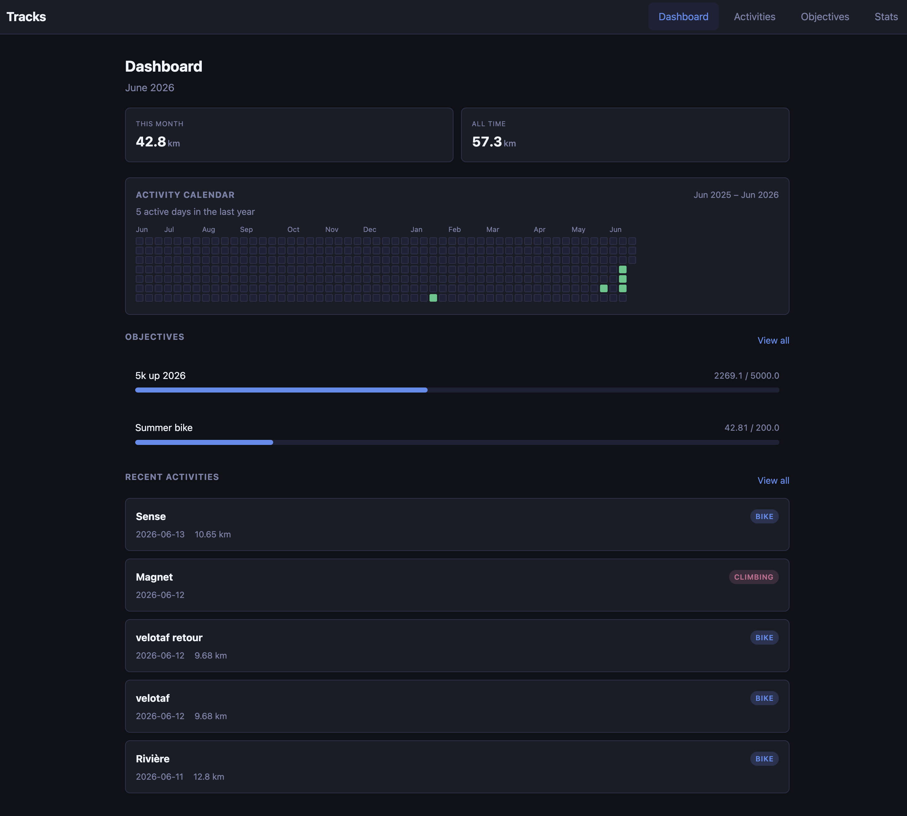
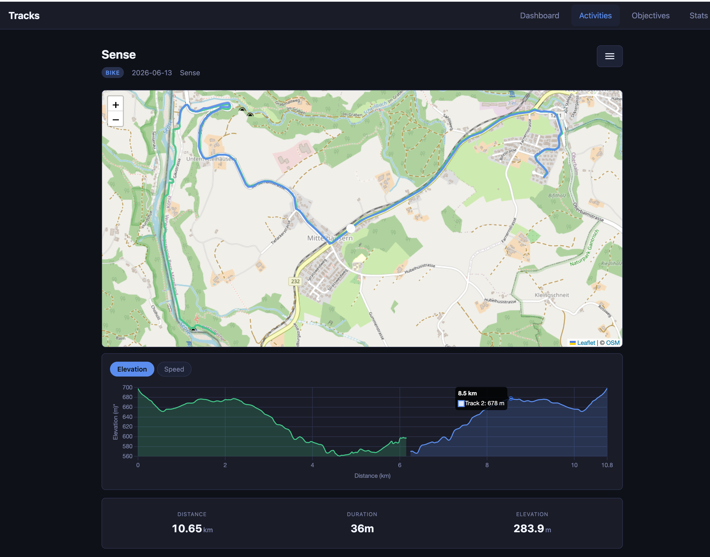
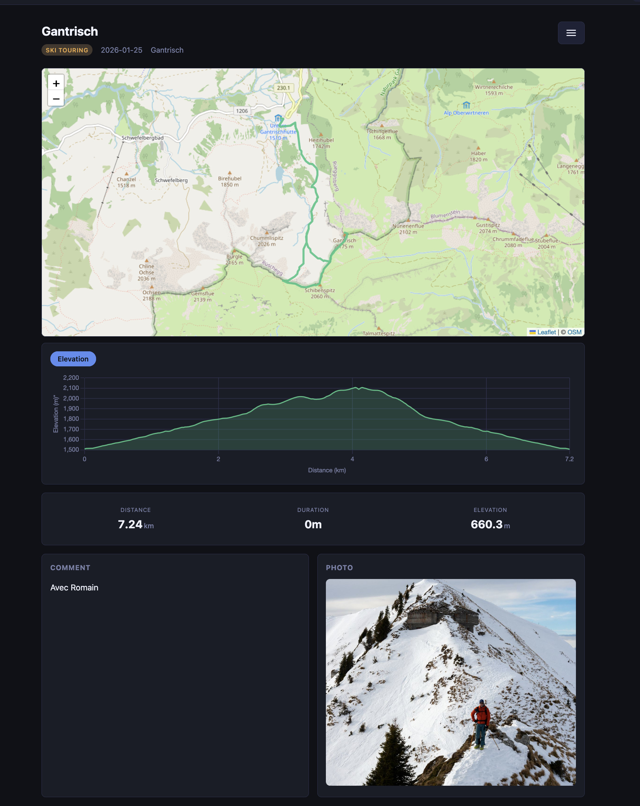
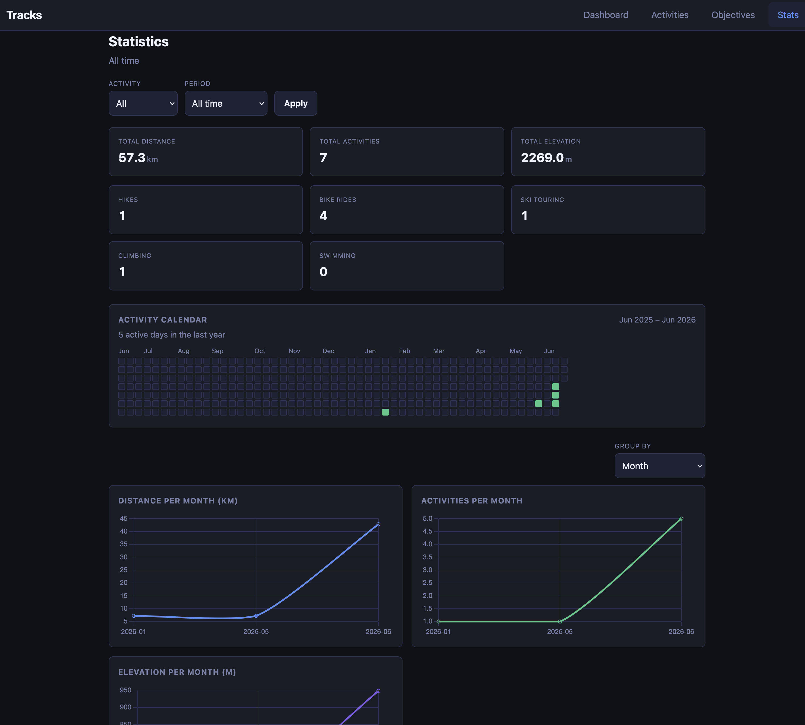

# Tracks

Self-hosted web app for logging sport activities (hikes and bike rides) with GPX traces, maps, statistics, and goals.

## Screenshots

| Dashboard | Activity detail |
| --- | --- |
|  |  |

| Photo & comment | Statistics |
| --- | --- |
|  |  |

## Features

- Log activities with date, place, type, comment, GPX trace, and photo
- Map view with GPS trace (Leaflet + OpenStreetMap)
- Activity log with filters
- Dashboard with recent outings and quick stats
- Objectives (distance, duration, or activity count)
- Statistics charts
- Responsive UI for mobile and desktop

No login — intended for single-user use on a trusted network (e.g. your LAN).

## Quick start

```bash
docker compose up --build
```

Open [http://localhost:8080](http://localhost:8080).

Data (SQLite database, GPX files, photos) is stored in `./data/`.

## Development

```bash
python3 -m venv .venv
source .venv/bin/activate
pip install -r requirements.txt
alembic upgrade head
uvicorn app.main:app --reload --host 0.0.0.0 --port 8080
```

Run tests (with the venv activated, or use the venv binary directly):

```bash
pytest
# or without activating:
.venv/bin/pytest
```

## Configuration

| Variable | Default | Description |
|----------|---------|-------------|
| `DATA_DIR` | `data` | Directory for database and uploads |

## Project structure

- `app/` — FastAPI application, templates, static assets
- `alembic/` — database migrations
- `data/` — persisted data (gitignored)
