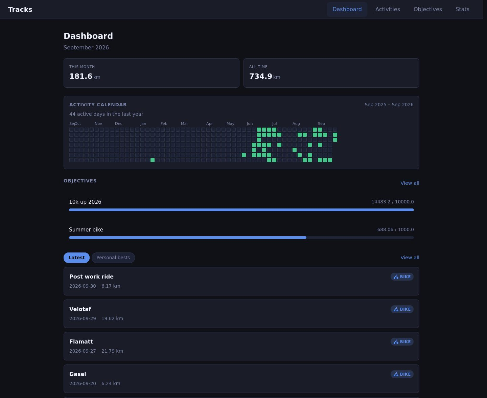
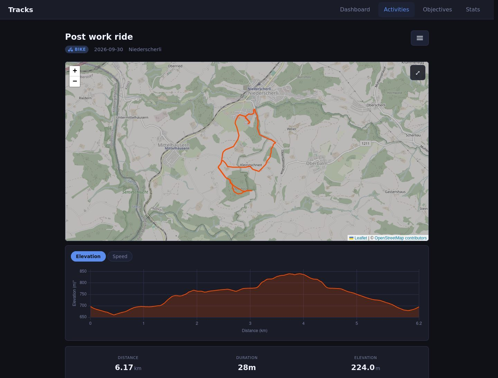
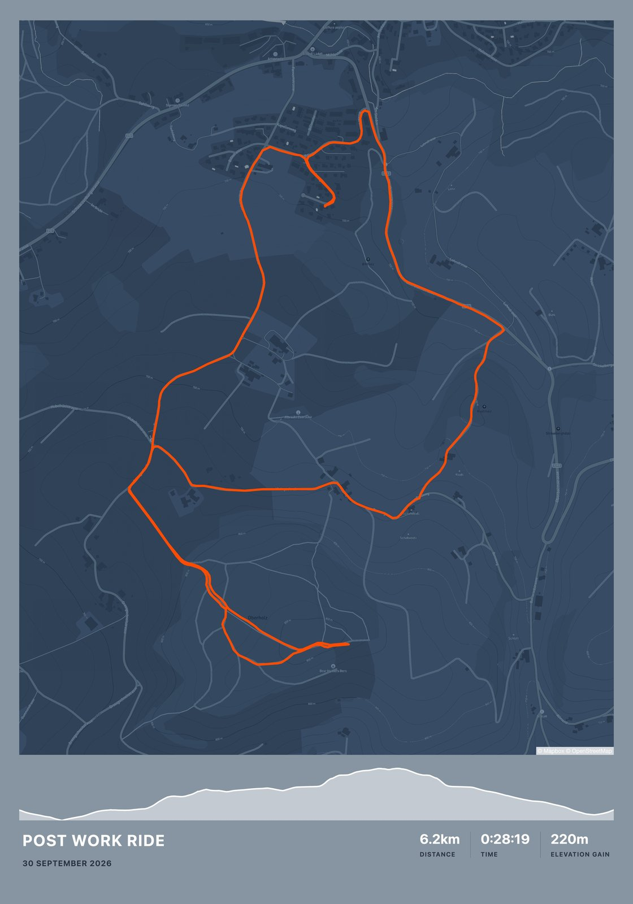
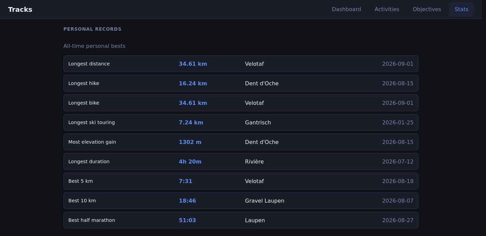

# Tracks

Self-hosted web app for logging sport activities — hikes, bike rides, ski tours, climbs, and swims — with GPX traces, maps, statistics, and goals.

## Screenshots

| Dashboard | Activity |
| --- | --- |
|  |  |

| Share card | Personal records |
| --- | --- |
|  |  |

## Features

- Log hikes, bike rides, ski tours, climbs, and swims with a date, place, comment, GPX trace, and photos
- Map view with the GPS trace, elevation profile, and speed profile (Leaflet + OpenStreetMap)
- Activity list with search, sort, pagination, and type icons
- Dashboard with recent outings, objectives, and quick stats
- Objectives for distance, duration, or activity count
- Statistics with charts, an activity calendar, filters, and a track heatmap
- Personal records from logged outings
- Share card poster for an outing, opened in a full-page viewer
- Responsive layout for mobile and desktop

No login — intended for single-user use on a trusted network (e.g. your LAN).

## Quick start

```bash
docker compose up --build
```

Open [http://localhost:8080](http://localhost:8080).

Data (SQLite database, GPX files, photos) is stored in `./data/`.

## Development

```bash
python3 -m venv .venv
source .venv/bin/activate
pip install -r requirements.txt
alembic upgrade head
uvicorn app.main:app --reload --host 0.0.0.0 --port 8080
```

Run tests (with the venv activated, or use the venv binary directly):

```bash
pytest
# or without activating:
.venv/bin/pytest
```

## Configuration

| Variable | Default | Description |
|----------|---------|-------------|
| `DATA_DIR` | `data` | Directory for database and uploads |

## Project structure

- `app/` — FastAPI application, templates, static assets
- `alembic/` — database migrations
- `data/` — persisted data (gitignored)
