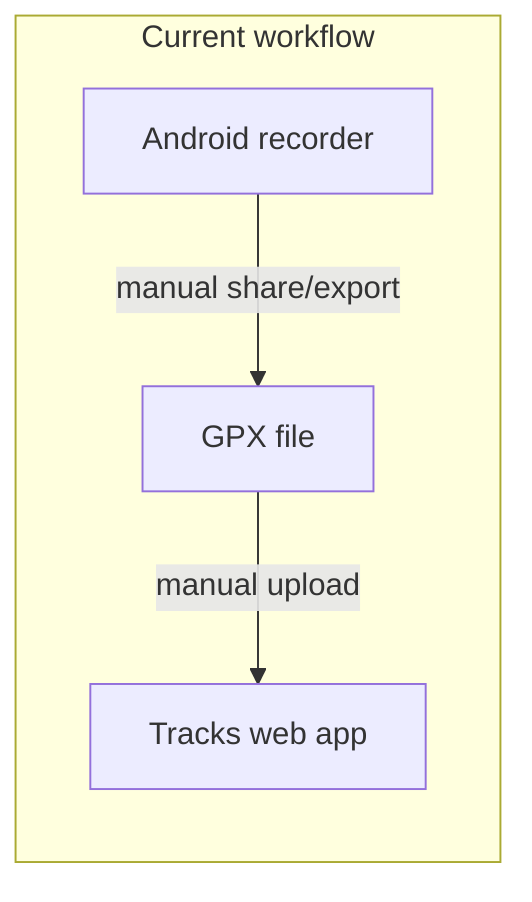
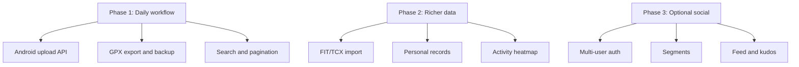

# Tracks: Future Roadmap

Living document of potential features and improvements. Not committed work — use this to track ideas and prioritize over time.

## Current state

Tracks is a polished **single-user, LAN-trusted** activity journal—not yet a full Strava clone.

| Area | Implemented |
|------|-------------|
| Web app | FastAPI + Jinja2, Docker, SQLite in [`data/`](data/) |
| Activities | 5 types (hike, bike, skitouring, climbing, swimming), GPX upload, photos, comments |
| Maps & charts | Leaflet/OSM map, elevation + speed profiles, multi-track support, trim editor |
| Analytics | Dashboard, stats page, activity calendar, objectives/goals |
| Elevation | Background worker + OpenTopoData cache ([`app/services/elevation_worker.py`](app/services/elevation_worker.py)) |
| Android | Separate Flutter recorder ([`android_compagnon/`](android_compagnon/)) — local SQLite, GPX export only |

Explicit non-goals in [`README.md`](README.md): **no login**, **no social layer**.

The biggest practical gap is the **disconnected phone → server pipeline**. Most other gaps depend on whether you want to stay personal-only or grow toward multi-user/social.

---

## Tracking

| ID | Item | Tier | Status |
|----|------|------|--------|
| sync-api | Android ↔ server GPX upload API + token auth | 1 | pending |
| export-backup | Per-activity GPX download and bulk backup/export | 1 | pending |
| search-pagination | Activity list search, sort, and pagination | 1 | done |
| personal-records | PR detection from existing speed/distance data | 1 | pending |
| fit-import | FIT/TCX import with HR/cadence/power extraction | 1 | pending |
| heatmap | Aggregate activity heatmap on stats/map page | 2 | pending |
| tests | pytest coverage for GPX parsing, stats, objectives | 4 | pending |

---

## Tier 1 — High impact, fits current philosophy

These extend the existing product without turning it into Strava.

### 1. Android ↔ server sync (upload API)

**Why:** The companion app already records and exports GPX; the web app already parses GPX. Today the user must manually transfer files.

**Proposal:**
- Add a small authenticated (or token-based) REST endpoint, e.g. `POST /api/activities` accepting GPX + metadata (name, type, date).
- Android: after stop, offer “Upload to Tracks” with server URL + API token in settings.
- Reuse existing [`app/services/gpx.py`](app/services/gpx.py) and activity creation logic from [`app/routers/activities.py`](app/routers/activities.py).

**Effort:** Medium · **Value:** Very high for daily use.

### 2. GPX export + backup/restore from the web app

**Why:** Data lives in `./data/` but there is no in-app export. Users cannot easily move instances, share a trace, or recover from mistakes.

**Proposal:**
- Per-activity “Download GPX” on detail page.
- Bulk export (all activities as ZIP of GPX + JSON metadata).
- Optional scheduled backup script or admin page that zips `data/`.

**Effort:** Low–medium · **Value:** High for self-hosting trust.

### 3. Activity search, sort, and pagination ✓

**Status:** Done — search on name/place/comment, sort by date/distance/elevation, paginated list (25 per page).

**Why:** [`app/routers/activities.py`](app/routers/activities.py) lists all activities with type/date filters only. As the log grows, finding “that Chamonix ride” gets painful.

**Proposal:**
- Text search on name, place, comment.
- Sort by date, distance, elevation.
- Pagination or infinite scroll on [`app/templates/activities/list.html`](app/templates/activities/list.html).

**Effort:** Low · **Value:** Medium–high over time.

### 4. Personal records (PRs) and “best efforts”

**Why:** Strava’s stickiest feature for solo athletes is automatic PR detection—not social kudos.

**Proposal:**
- Compute and surface PRs: longest ride, most elevation, fastest pace over standard distances (5k, 10k, half-marathon proxy for runs/hikes with speed data).
- Show badges on activity detail and a “Records” section on stats/dashboard.
- Leverage existing speed profile logic in [`app/services/gpx.py`](app/services/gpx.py).

**Effort:** Medium · **Value:** High motivation without social complexity.

### 5. Saved routes & repeat outings

**Why:** You store full GPX traces and bounds ([`Activity.bounds_json`](app/db/models.py)) but cannot reuse them as templates.

**Proposal:**
- “Save as route” from an activity.
- Route library: name, type, distance/elevation summary, map preview.
- “Start from route” pre-fills a new activity (web) or sends to Android as reference track.

**Effort:** Medium · **Value:** Medium–high for hikers/cyclists who repeat favorite loops.

### 6. FIT / TCX import (in addition to GPX)

**Why:** Watches and bike computers usually export FIT, not GPX. GPX-only limits the import story.

**Proposal:**
- Add FIT/TCX parsers (e.g. `fitdecode` or similar) that normalize to the same internal point model as GPX.
- Extract extra fields when present: HR, cadence, power, temperature.

**Effort:** Medium · **Value:** High if you import from Garmin/Wahoo/etc.

---

## Tier 2 — Sensor & analytics depth

Build on data you almost already capture.

### 7. Heart rate, cadence, and power charts

**Why:** Speed and elevation charts exist; sensor streams in FIT/GPX extensions do not.

**Proposal:**
- Extend [`ActivityTrack`](app/db/models.py) or store derived time-series JSON alongside elevation cache.
- Add profile tabs on activity detail (same pattern as elevation/speed in [`app/templates/activities/detail.html`](app/templates/activities/detail.html)).

**Effort:** Medium (depends on FIT import) · **Value:** Medium for cyclists/runners with sensors.

### 8. Activity heatmap & “where I’ve been” map

**Why:** Stats page has calendar and charts but no geographic aggregate view—a classic Strava-style personal insight.

**Proposal:**
- Server-side or client-side aggregation of all track coordinates into a heatmap layer (Leaflet.heat or Mapbox-style tile approach).
- Filter by activity type and date range (reuse stats filters from [`app/routers/pages.py`](app/routers/pages.py)).

**Effort:** Medium · **Value:** Medium; great visual payoff.

### 9. Smarter objectives & streaks

**Why:** Objectives exist ([`app/services/objectives.py`](app/services/objectives.py)) but are static targets only.

**Proposal:**
- Weekly streak counter on dashboard (“4 weeks with ≥1 hike”).
- Rolling objectives (e.g. “100 km in any 30-day window”).
- Notifications when close to goal (email/webhook optional for self-hosted).

**Effort:** Low–medium · **Value:** Medium engagement boost.

### 10. Gear / equipment tracking

**Why:** Self-hosters often want “how many km on these hiking boots / this bike” without SaaS lock-in.

**Proposal:**
- `Gear` model: name, type, retire date.
- Optional gear assignment per activity; cumulative distance/duration per item.

**Effort:** Low · **Value:** Medium for long-term logging.

---

## Tier 3 — Strava-like expansion (scope change)

Only pursue if you want to move beyond “trusted LAN diary.”

### 11. Optional multi-user auth

**Why:** README states no login. Any shared or internet-exposed instance needs auth.

**Proposal:**
- Single-user API token first (minimal change).
- Later: username/password or OIDC (Authelia, Authentik) for household or small club.

**Effort:** Medium–high · **Value:** Required before social or public deployment.

### 12. Segments & leaderboards

**Why:** Core Strava differentiator; technically non-trivial.

**Proposal:**
- Define segment polyline + match algorithm against uploaded tracks.
- Personal leaderboard first (your times on segment X); multi-user later.

**Effort:** High · **Value:** High for competitive cyclists, low for hiking diary use.

### 13. Social layer (follow, feed, kudos, clubs)

**Why:** Completely absent; largest gap vs Strava.

**Proposal:** Defer unless multi-user auth is in place. If needed, start with read-only public activity links before full social graph.

**Effort:** Very high · **Value:** Depends entirely on audience.

---

## Tier 4 — Quality, ops, and UX polish

### 14. Automated tests

**Why:** No test suite found. GPX parsing, trim logic, stats aggregation, and elevation caching are regression-prone ([`app/services/gpx.py`](app/services/gpx.py), [`app/services/stats.py`](app/services/stats.py)).

**Proposal:** pytest with fixture GPX files; cover trim, multi-track aggregation, objective progress.

**Effort:** Medium · **Value:** High for maintainability.

### 15. Lightweight JSON API + OpenAPI

**Why:** Endpoints like `/activities/{id}/gpx.geojson` exist, but there is no cohesive API for scripts, mobile, or automation.

**Proposal:** Versioned `/api/v1/...` alongside HTML routes; document in FastAPI OpenAPI UI.

**Effort:** Low–medium · **Value:** Enables sync, scripts, integrations.

### 16. PWA / offline-friendly web UI

**Why:** Responsive UI exists; recording on the web (mobile browser) does not.

**Proposal:** Service worker for read-only offline viewing of recent activities; optional browser Geolocation recording for quick logs without the Android app.

**Effort:** Medium · **Value:** Medium if you want one less app.

### 17. Import from Strava / Garmin export

**Why:** Migration path for people leaving Strava.

**Proposal:** Bulk import Strava export ZIP (activities + GPX) into existing models.

**Effort:** Medium · **Value:** High for onboarding, one-time.

---

## Suggested roadmap (if picking a few)

**Recommended first three (best ROI for this codebase):**
1. **Android ↔ server sync** — closes the biggest workflow hole.
2. **Export/backup** — essential for self-hosted trust.
3. **Personal records or FIT import** — pick based on whether you care more about motivation (PRs) or device compatibility (FIT).

---

## What not to prioritize early

- Full Strava social graph before auth and a clear multi-user story.
- Live segment racing / real-time leaderboards — high complexity, niche for hiking-focused app.
- Replacing the server-rendered UI with SPA — current stack is coherent and fast to iterate.
